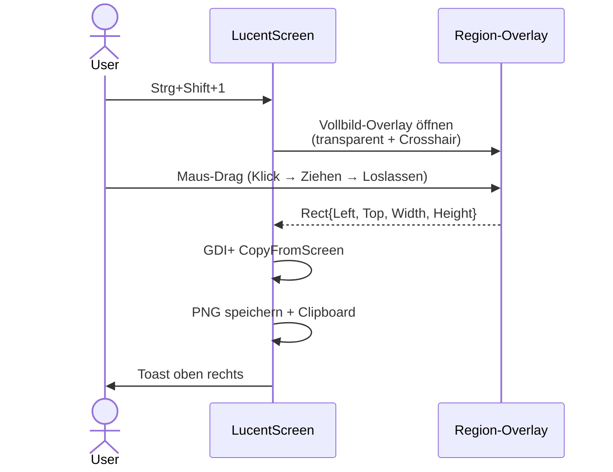
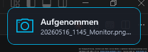

# Bereich-Capture

Capture eines frei wählbaren Rechtecks. Tastenkombination: **`Strg+Shift+1`** (Default — in der Konfiguration änderbar).

## Ablauf

{ width=600 }

## Tipps

- **Abbruch**: `Esc` während des Overlays — kein Capture.
- **Multi-Monitor**: das Overlay deckt den **virtuellen Gesamt-Bildschirm** ab (alle Monitore zusammen). Du kannst über Monitor-Grenzen hinweg ziehen.
- **Verzögerung**: wenn `DelaySeconds > 0` (siehe [Konfiguration](../referenz/konfiguration.md)), zeigt LucentScreen vor jeder Aufnahme einen Countdown-Overlay. Praktisch z.B. um vorher noch ein Menü aufzuklappen, das bei Tastendruck verschwindet.
- **Zwischenablage**: das Bild liegt sofort als Image im Clipboard — direkt in Word/Outlook/Teams einfügbar.

{ width=300 }

## Speicherort

`%USERPROFILE%\Pictures\LucentScreen\<yyyyMMdd>_<HHmm>_Region.png`

Bei Kollision (zwei Aufnahmen in derselben Minute) wird `-2`, `-3`, … angehängt.

→ [Filename-Schema](../referenz/konfiguration.md#dateinamen-schema)
