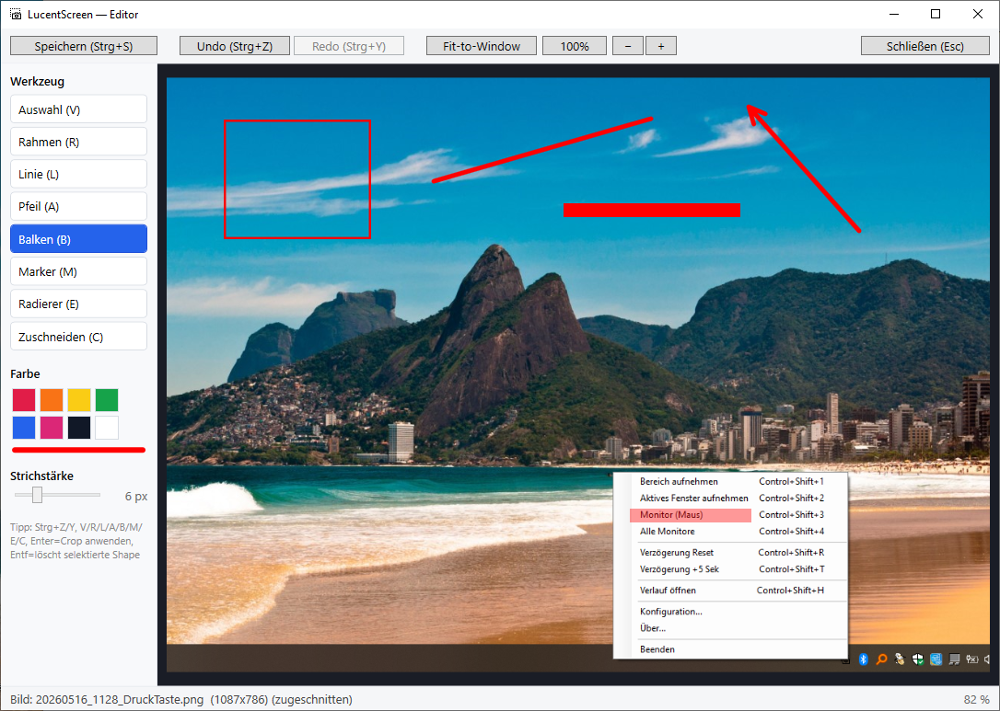
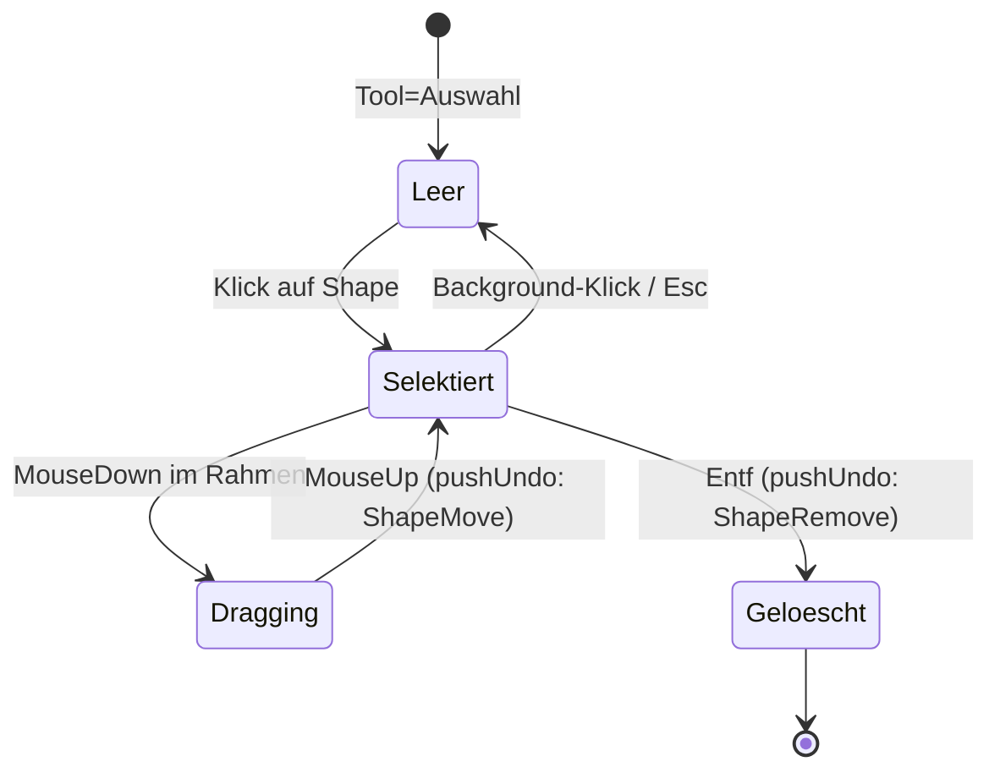
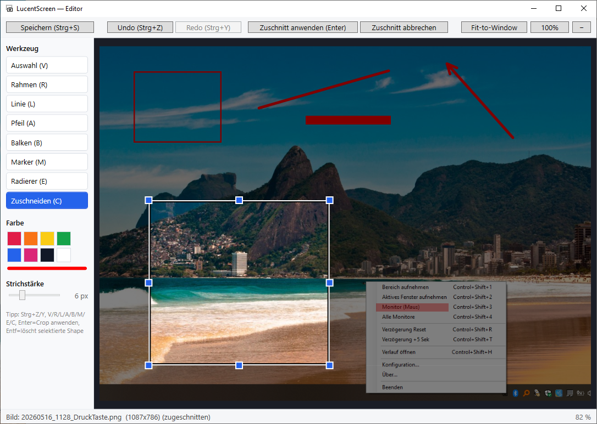

# Editor

Mini-Editor für Annotations + Crop. Öffnet sich per **Doppelklick** (oder `Enter`) auf ein Bild im Verlaufsfenster.

{ width=700 }

## Werkzeugleiste

| Werkzeug | Taste | Was es macht |
|---|---|---|
| **Auswahl** | `V` | Shape selektieren (Adorner), Drag verschiebt, `Entf` löscht |
| **Rahmen** | `R` | Rechteck (nur Stroke) |
| **Linie** | `L` | Gerade mit abgerundeten Enden |
| **Pfeil** | `A` | Linie + Pfeilspitze |
| **Balken** | `B` | Gefülltes Rechteck (z.B. zum Schwärzen) |
| **Marker** | `M` | Highlighter — gefülltes Rechteck mit 40% Alpha |
| **Radierer** | `E` | Klick auf Shape entfernt sie |
| **Zuschneiden** | `C` | 8-Handle-Crop mit Dimmer-Overlay |

## Farbe und Strichstärke

8 Farb-Swatches (Rot/Orange/Gelb/Grün/Blau/Magenta/Schwarz/Weiß) im Side-Panel. Der dünne Streifen darunter zeigt die aktuelle Farbe. Strichstärke per Slider 1–20 px.

## Selection (Auswahl-Tool)

Der Selection-Adorner ist ein gestricheltes blaues Bounding-Box-Rectangle. Beim Speichern wird er automatisch entfernt — landet **nicht** im PNG.

## Crop (Zuschneiden)

{ width=600 }

- 8 Handles (4 Ecken + 4 Kanten) zum Resize
- Drag im Inneren verschiebt
- Bereich außerhalb ist abgedunkelt
- `Enter` oder Toolbar-Button → Zuschnitt anwenden
- `Esc` während aktivem Crop → abbrechen
- **Crop ist undo-fähig** (`Strg+Z` macht das Bild wiederher, mit allen Annotations an alter Position)

## Undo / Redo

- `Strg+Z` rückgängig
- `Strg+Y` wiederholen
- Stack hält drei Aktions-Typen: **Shape** (zeichnen), **ShapeRemove** (radieren / Entf), **ShapeMove** (Selection-Drag), **Crop** (Zuschneiden)

## Speichern

`Strg+S` oder Toolbar-Button:

1. Editor render Bitmap + Annotations bei Zoom 1.0 in PNG-Auflösung
2. Schreibt nach `<original>_edited.png` (Postfix konfigurierbar)
3. Bild landet zusätzlich in der Zwischenablage
4. **Editor schließt automatisch** + Toast „Gespeichert + kopiert" oben rechts

## ESC bei ungespeicherten Änderungen

Wenn `IsDirty` (mindestens eine Aktion auf dem Undo-Stack), zeigt der Editor beim Schließen einen Confirm-Dialog: „Ungespeicherte Änderungen verwerfen? — Ja / Nein". Bei „Nein" bleibt der Editor offen.

## Bekannte Tastenkürzel-Konflikte

`E` ist sowohl Eraser als auch Standard-Windows-Hotkey für „Edit"-Menüs. Im Editor-Fenster greift Eraser, weil PreviewKeyDown auf Window-Ebene Vorrang hat.
