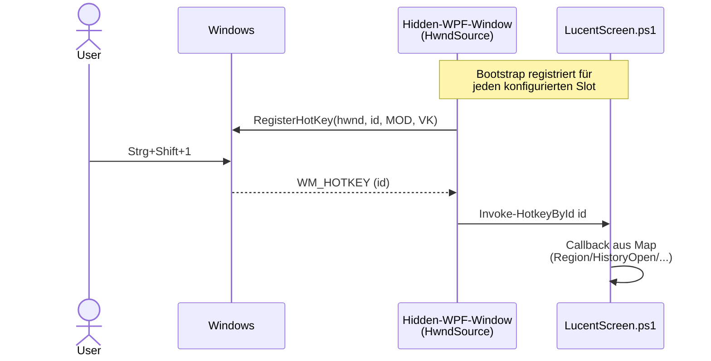

# Hotkeys

LucentScreen registriert globale Tastenkombinationen über die Windows-API `RegisterHotKey`. Sie funktionieren in jeder Anwendung — auch wenn LucentScreen kein Fokus-Fenster hat.

## Default-Belegung

| Aktion | Tastenkombination | Tray-Eintrag |
|---|---|---|
| Bereich aufnehmen | `Strg+Shift+1` | Bereich aufnehmen |
| Aktives Fenster | `Strg+Shift+2` | Aktives Fenster aufnehmen |
| Monitor unter Maus | `Strg+Shift+3` | Monitor (Maus) |
| Alle Monitore | `Strg+Shift+4` | Alle Monitore |
| Verzögerung Reset (= 0 Sek) | `Strg+Shift+R` | Verzögerung Reset |
| Verzögerung +5 Sek | `Strg+Shift+T` | Verzögerung +5 Sek |
| Verlauf öffnen | `Strg+Shift+H` | Verlauf öffnen |
| Tray-Menü öffnen | `Strg+Shift+0` | (Menü-Klick) |

Im Tray-Kontextmenü stehen die aktuell konfigurierten Hotkeys rechts neben jedem Eintrag.

{ width=400 }

## Belegung ändern

Tray → **Konfiguration…** → GroupBox „Hotkeys": klick in das Feld und drück die gewünschte Kombi. **Speichern** registriert die Hotkeys live neu — kein App-Neustart nötig.

> Die Anzeige im Tray-Menü aktualisiert sich erst beim nächsten App-Start (das Menü wird beim Bootstrap einmal gebaut).

## Konflikte

LucentScreen erkennt vor dem Speichern, wenn zwei Slots dieselbe Kombi haben → Validation-Fehler im Konfig-Dialog.

Konflikte mit anderen Apps (z.B. ein Hotkey ist von Snipping Tool belegt) lassen sich erst beim Registrieren feststellen — dann landet der Slot in der Conflicts-Liste, der Hotkey ist nicht aktiv. Im App-Log (`%LOCALAPPDATA%\LucentScreen\logs\app.log`) steht die Win32-Fehlernummer.

## Mechanik

Implementierungs-Details siehe [Hotkey-System Referenz](../referenz/hotkey-system.md).
