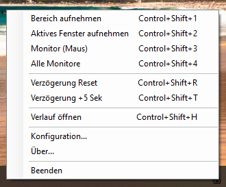
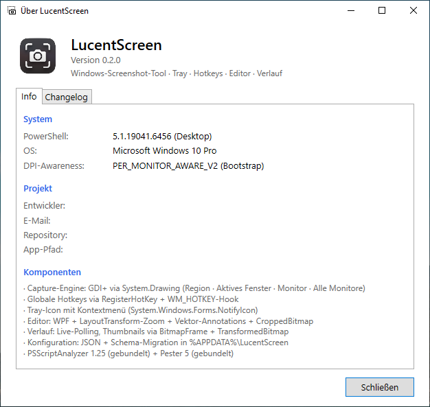

# Tray-Icon

LucentScreen läuft im Hintergrund. Das Icon liegt im Infobereich der Taskleiste (rechts unten neben der Uhr).

## Wo finde ich das Icon?

Windows versteckt das Icon nach dem ersten Start in der **Overflow-Area** — dem kleinen Pfeil `^` neben der Uhr. Ein Klick darauf zeigt alle dort versteckten Icons.

Damit das LucentScreen-Icon dauerhaft sichtbar bleibt:

1. Rechtsklick auf die Taskleiste → **Taskleisten-Einstellungen**
2. Abschnitt **Infobereich** → **Andere Symbole im Infobereich auswählen, die in der Taskleiste angezeigt werden**
3. Eintrag **LucentScreen** auf **Ein** schalten

## Bedienung

| Aktion | Wirkung |
|---|---|
| **Linke Maustaste (doppelt)** | Bereichs-Capture starten (wie `Ctrl+Shift+1`) |
| **Rechte Maustaste** | Kontextmenü öffnen |

## Kontextmenü

{ width=400 }

| Eintrag | Default-Hotkey | Wirkung |
|---|---|---|
| Bereich aufnehmen | `Strg+Shift+1` | Vollbild-Overlay, mit Maus Rechteck aufziehen |
| Aktives Fenster aufnehmen | `Strg+Shift+2` | Vordergrundfenster ohne Schatten |
| Monitor (Maus) | `Strg+Shift+3` | Bildschirm unter dem Cursor |
| Alle Monitore | `Strg+Shift+4` | Gesamter virtueller Bildschirm |
| ─ | | |
| Verzögerung Reset | `Strg+Shift+R` | DelaySeconds = 0 |
| Verzögerung +5 Sek | `Strg+Shift+T` | DelaySeconds += 5 (max. 30) |
| ─ | | |
| Verlauf öffnen | `Strg+Shift+H` | [Verlaufsfenster](verlauf.md) |
| ─ | | |
| Konfiguration… | — | Hotkeys, Zielordner, Dateinamen-Format, Icon-Größe |
| Über… | — | Version, System, Entwickler, Changelog |
| ─ | | |
| Beenden | — | App sauber beenden |

Die Hotkey-Anzeige rechts neben den Einträgen spiegelt die aktuelle Konfiguration. Beim ersten App-Start mit den Defaults siehst du obige Werte. Nach Änderung im Konfig-Dialog wird die Anzeige beim nächsten App-Start aktualisiert; die Hotkey-Registrierung selbst geschieht sofort.

## Über-Dialog

Der Eintrag **Über…** öffnet ein Fenster mit Version, System-Infos, Projekt-Daten und einem Tab mit dem aktuellen Changelog.

{ width=500 }

## Bestätigung dass die App läuft

Falls Sie das Icon nicht finden: drücken Sie `Ctrl+Shift+3`. Wenn ein Screenshot in `~/Pictures/LucentScreen/` auftaucht, läuft die App.
