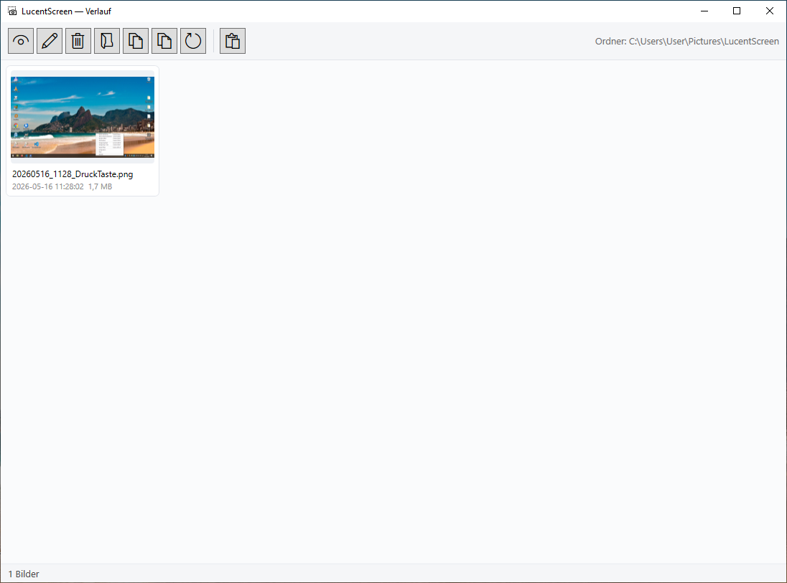

# Verlauf

Übersicht aller Screenshots im Zielordner. Tray → **Verlauf öffnen** (oder `Strg+Shift+H`).

{ width=700 }

## Toolbar

7 Icon-Buttons (Segoe MDL2). Die Größe ist konfigurierbar (Konfig → Toolbar-Icon-Größe, 16–32 pt).

| Icon | Aktion | Was es macht |
|---|---|---|
| 👁 | **Anzeigen** | Bild im Standard-Bildbetrachter (Default-App) |
| ✎ | **Bearbeiten** | Editor öffnen (= Doppelklick / `Enter`) |
| 🗑 | **Löschen** | Markierte Bilder in den Papierkorb |
| 📂 | **Speicherort** | Explorer öffnet, Datei markiert |
| 📋 | **Zwischenablage** | Markiertes Bild als Image ins Clipboard (`Strg+C`) |
| 📑 | **Zwischenablage (Liste)** | Mehrere Dateien als Datei-Liste — Word/Outlook fügt alle ein |
| ↻ | **Aktualisieren** | Verlauf neu einlesen (`F5`) |

## Tastatur

| Taste | Aktion |
|---|---|
| `Doppelklick` / `Enter` | Editor öffnen |
| `Strg+C` | Single-Bild ins Clipboard |
| `Entf` | In Papierkorb |
| `F5` | Refresh |
| `Esc` | Verlauf schließen |

## Kontextmenü

Rechtsklick auf ein Bild zeigt:

{ width=400 }

- Editieren
- Öffnen (Default-App)
- Im Ordner zeigen
- In Zwischenablage kopieren
- ─
- In Papierkorb verschieben

## Live-Polling

Der Verlauf aktualisiert sich automatisch alle 2 Sekunden — neue Captures erscheinen ohne manuellen Refresh. Implementierung via `DispatcherTimer` (kein `FileSystemWatcher` — der schießt unter PowerShell den Worker-Thread ab; siehe [Stolpersteine](../entwicklung/stolpersteine.md)).

## Multi-Auswahl

`Strg+Klick` / `Shift+Klick` markiert mehrere Bilder. Aktionen wirken auf alle:

- **Löschen**: alle markierten in den Papierkorb (mit Confirm)
- **Zwischenablage (Liste)**: alle Dateien als FileDropList
- **Bearbeiten**: öffnet sequentiell mehrere Editor-Fenster (jedes blockierend)

## Speicherort konfigurieren

Tray → Konfiguration → **Zielordner**. Default ist `%USERPROFILE%\Pictures\LucentScreen\`. Nach Änderung neu öffnen.
