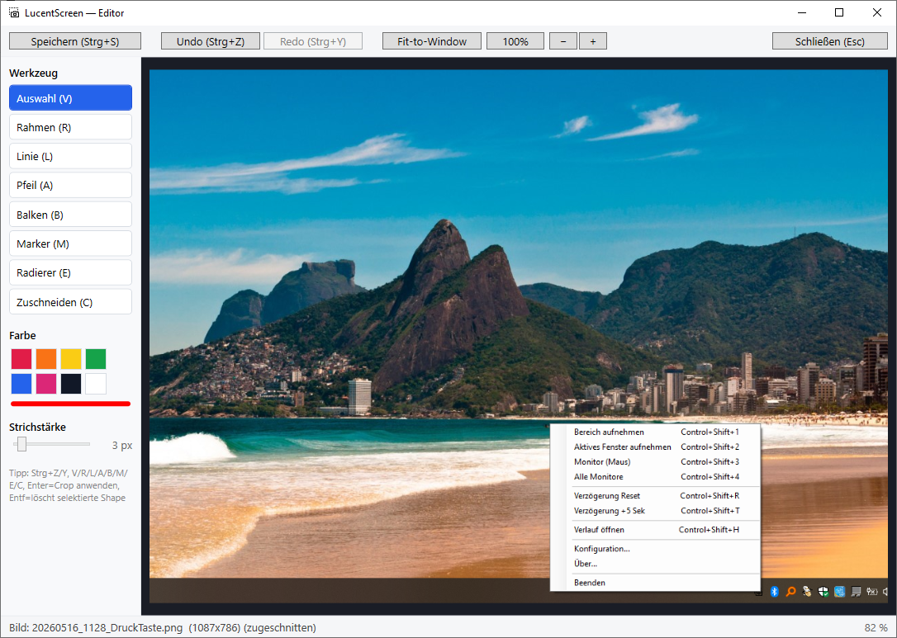

# Schnellstart

## 1. Starten

LucentScreen läuft als **Tray-Anwendung** im Hintergrund. Nach dem Start erscheint ein Kamera-Icon im System-Tray (rechte untere Ecke der Taskleiste). Es öffnet sich kein Hauptfenster.

> Wenn du das Icon nicht siehst: Klick auf den ↑-Pfeil im Tray-Bereich — Windows blendet selten genutzte Icons standardmäßig aus.

{ width=400 }

## 2. Den ersten Screenshot machen

Drei einfache Wege:

| Aktion | Hotkey | Was passiert |
|---|---|---|
| **Bereich** | `Strg+Shift+1` | Vollbild-Overlay → Maus-Drag wählt Rechteck |
| **Aktives Fenster** | `Strg+Shift+2` | Fenster unter Cursor wird sofort aufgenommen |
| **Monitor unter Maus** | `Strg+Shift+3` | Ganzer Bildschirm |
| **Alle Monitore** | `Strg+Shift+4` | Virtueller Gesamt-Bildschirm |

Nach dem Capture:

- PNG landet in `%USERPROFILE%\Pictures\LucentScreen\`
- Bild liegt zusätzlich in der **Zwischenablage** — direkt einfügbar in Word/Outlook/Mail
- Toast oben rechts bestätigt für ~1.4 Sekunden

## 3. Verlauf öffnen

Tray → **Verlauf öffnen** (oder `Strg+Shift+H`):

{ width=600 }

Doppelklick auf ein Bild öffnet den **Editor**.

## 4. Editor-Basics

{ width=600 }

| Werkzeug | Tastenkürzel |
|---|---|
| Auswahl | `V` |
| Rahmen | `R` |
| Linie | `L` |
| Pfeil | `A` |
| Balken | `B` |
| Marker | `M` |
| Radierer | `E` |
| Zuschneiden | `C` |

Speichern mit `Strg+S` — der Editor schließt automatisch, das Bild liegt in der Zwischenablage und im Verlauf taucht eine `*_edited.png` auf.

→ [Editor im Detail](../anleitung/editor.md)

## 5. Konfiguration

Tray → **Konfiguration…** öffnet den Einstellungen-Dialog: Zielordner, Dateinamen-Schema, Verzögerung, Hotkeys, Toolbar-Icon-Größe.

→ [Konfigurations-Referenz](../referenz/konfiguration.md)
