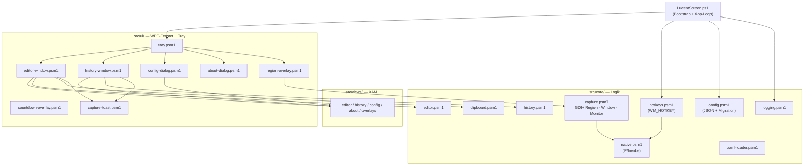
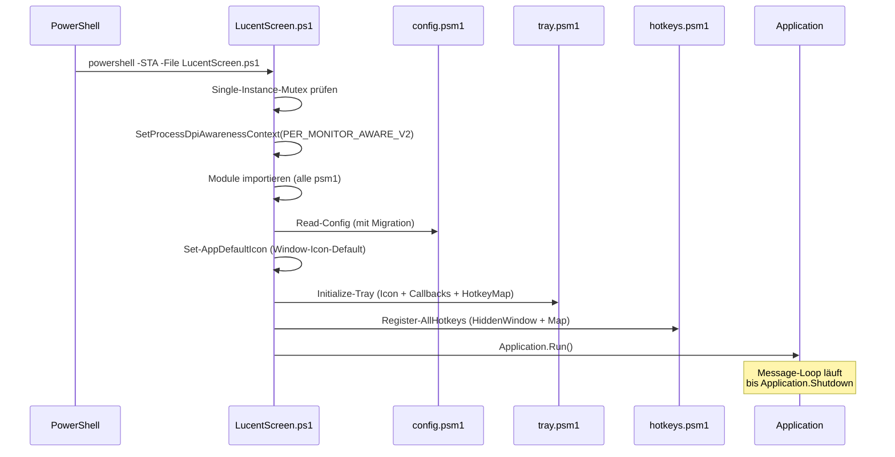

# Architektur

LucentScreen ist eine **Windows-PowerShell-5.1-WPF-Anwendung** mit strikter Layer-Trennung. Kein Compile-Step, kein .NET-Runtime-Install — die App läuft auf jedem Windows 10/11 mit vorinstalliertem PowerShell 5.1.

## Layer-Modell



## Layer-Regeln

| Layer | Pfad | Darf | Darf nicht |
|---|---|---|---|
| **core** | `src/core/*.psm1` | Logik, GDI+, P/Invoke, Konfig, Logging | `PresentationFramework`, XAML, Tray |
| **ui** | `src/ui/*.psm1` | XAML laden, Fenster, Hotkey-Hook, NotifyIcon | Direkte Domain-Logik (delegiert an core) |
| **views** | `src/views/*.xaml` | Reine XAML-Markup-Dateien | Code-Behind |
| **main.ps1** | `src/LucentScreen.ps1` | Bootstrap + Application-Loop | Sonst nichts |

> `main.ps1` ist der **einzige Ort**, der `core` und `ui` zusammensteckt. `ui` darf nicht von `core` umgekehrt importiert werden.

## Bootstrap-Sequenz



## Process-Modell

- **Single-Instance** via `System.Threading.Mutex` (`Global\LucentScreen.SingleInstance`).
- **STA-Apartment** zwingend für WPF + Clipboard. `LucentScreen.ps1` macht ein Self-Relaunch wenn nicht im STA gestartet.
- **DPI-Awareness** PER_MONITOR_AWARE_V2 als allererster Schritt nach Logging.
- **App-Shutdown**: tray-Eintrag „Beenden" oder `Application.Current.Shutdown()`. NotifyIcon wird per Dispose-Closure beim `Application.Exit`-Event aufgeräumt (sonst bleibt das Tray-Icon bis Mouseover stehen).

## Konventionen

- **Sprache**: UI/Doku Deutsch, Code/Variablen/Logs intern Englisch, User-sichtbare Logs Deutsch.
- **Result-Hashtables** statt Exceptions für erwartbare Fehler:
  ```powershell
  return @{ Success = $true;  Status = 'OK';    Message = '…'; Path = $path }
  return @{ Success = $false; Status = 'Error'; Message = '…'; Path = $null }
  ```
- **Config-Pfad**: `%APPDATA%\LucentScreen\config.json` (NIE im Programmordner — MSI/Per-Machine-kompatibel).
- **Logs-Pfad**: `%LOCALAPPDATA%\LucentScreen\logs\app.log` (mit 7-Tage-Rotation).
- **Default-Output**: `%USERPROFILE%\Pictures\LucentScreen\`.

→ [Projektstruktur](../entwicklung/projektstruktur.md) für die konkrete Datei-Übersicht.
