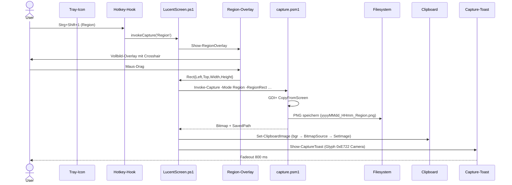

# Capture-Modi

Vier Modi, alle in `src/core/capture.psm1::Invoke-Capture` implementiert. Jeder Modus liefert ein `System.Drawing.Bitmap`, das danach via `Save-Capture` zu PNG geschrieben + via `Set-ClipboardImage` ins Clipboard kopiert wird.

## Region

**Hotkey:** `Strg+Shift+1`

User zieht ein Rechteck im Vollbild-Overlay. Implementierung: `region-overlay.psm1` zeigt ein transparentes WPF-Vollbild-Window über alle Monitore (`VirtualScreenBounds`) mit Crosshair-Cursor. Maus-Drag liefert das Rechteck; danach `Capture-Rect` mit GDI+ `Graphics.CopyFromScreen`.

→ [Bereich-Capture Anleitung](../anleitung/bereich-capture.md)

## ActiveWindow

**Hotkey:** `Strg+Shift+2`

Vordergrundfenster ohne Schatten. `Get-ForegroundWindowRect` nutzt zwei APIs in dieser Reihenfolge:

1. **DWM** — `DwmGetWindowAttribute` mit `DWMWA_EXTENDED_FRAME_BOUNDS`. Liefert das **sichtbare** Fenster ohne Schatten.
2. **Fallback** — `GetWindowRect` (bei nicht-DWM-Fenstern, z.B. Konsolen).

Capture wie bei Region.

> Die App selbst ist kein Vordergrundfenster (Tray-only) — daher landet immer das User-Fenster im Capture, nicht LucentScreen.

## Monitor

**Hotkey:** `Strg+Shift+3`

Bildschirm unter dem Cursor. `Get-ScreenUnderCursor` (`System.Windows.Forms.Screen.FromPoint`) liefert das Screen-Objekt; sein `Bounds` ist die Capture-Region.

Beim Multi-Monitor-Setup ist das also der Bildschirm, auf dem die Maus zur Hotkey-Zeit war.

## AllMonitors

**Hotkey:** `Strg+Shift+4`

Virtueller Gesamt-Bildschirm. `Get-VirtualScreenBounds` liefert die Bounding-Box über alle Monitore (`SystemInformation.VirtualScreen`). Bei zwei 1920×1080-Monitoren nebeneinander z.B. 3840×1080.

> Bei Setups mit unterschiedlichen DPI-Einstellungen kann der Capture pixel-skaliert ungewohnt aussehen — DPI-Awareness PER_MONITOR_AWARE_V2 mildert das, ist aber nicht für GDI+ überall perfekt.

## Pipeline

Bei `Region` läuft das Overlay vor dem Capture — bei den anderen Modi entfällt die Overlay-Stufe und LucentScreen ruft `Invoke-Capture` direkt.

## Verzögerung

Wenn `DelaySeconds > 0` (siehe Konfig), zeigt `countdown-overlay.psm1` einen Countdown-Overlay vor jedem Capture. Bei `Region` läuft der Countdown **nach** der Region-Auswahl.

## Speicherort + Filename

PNG wird über `Save-Capture` geschrieben:

- Pfad: `<OutputDir>/<filename>` (Default `~/Pictures/LucentScreen/`)
- Filename via `Format-CaptureFilename` aus dem `FileNameFormat`-Template (Default `yyyyMMdd_HHmm_{mode}.png`)
- Bei Kollision: `Resolve-UniqueFilename` hängt `-2`, `-3`, … vor der Endung an

→ [Konfiguration / Dateinamen-Schema](konfiguration.md#dateinamen-schema)
