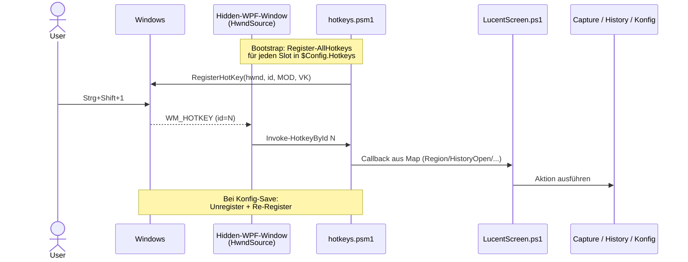

# Hotkey-System

LucentScreen registriert globale Hotkeys über die Win32-API `RegisterHotKey`. Implementierung in `src/core/hotkeys.psm1`.

## Mechanik



## Hidden-Window

WPF-Window mit `Visibility=Hidden`, Position außerhalb des Screens, `WindowStyle=None`. Es liefert nur den HWND, an dem `WM_HOTKEY` ankommt. `WindowInteropHelper.EnsureHandle()` erzeugt den Handle ohne `Show()` aufzurufen.

## Module

### `core/hotkeys.psm1`

| Funktion | Was |
|---|---|
| `Convert-ModifiersToFlags` | Liste `@('Control','Shift')` → MOD-Flags (`MOD_CONTROL = 2`, `MOD_SHIFT = 4`, `MOD_ALT = 1`, `MOD_WIN = 8`) |
| `Convert-KeyNameToVirtualKey` | WPF-Key-Name (`'D1'`, `'F4'`, `'A'`) → Win32 VK über `KeyInterop.VirtualKeyFromKey` |
| `Register-AllHotkeys` | Iteriert die Hotkey-Map, ruft `RegisterHotKey` pro Eintrag, baut intern eine ID→Callback-Registry |
| `Unregister-AllHotkeys` | Räumt vor App-Exit oder bei Re-Register auf |
| `Invoke-HotkeyById` | Vom HwndSource-Hook gerufen, dispatcht auf den Callback |

### `core/native.psm1`

`Add-Type` mit P/Invoke-Block `LucentScreen.Native`. Bietet `RegisterHotKey`/`UnregisterHotKey` plus die anderen WinAPI-Calls (DPI, Cursor, ForegroundWindow, DWM-Frame).

### `LucentScreen.ps1`

Hidden-Window + HwndSource-Hook:

```powershell
$source = [System.Windows.Interop.HwndSource]::FromHwnd($script:HotkeyHwnd)
$source.AddHook({
    param($hwnd, $msg, $wParam, $lParam, [ref]$handled)
    if ($msg -eq 0x0312) {  # WM_HOTKEY
        Invoke-HotkeyById ([int]$wParam)
        $handled.Value = $true
    }
    return [IntPtr]::Zero
})
```

## Re-Register bei Konfig-Save

Wenn der User im Konfig-Dialog Hotkeys ändert + Speichert, läuft im Tray-Config-Callback:

```powershell
$hkResult = Register-AllHotkeys -Hwnd $script:HotkeyHwnd -HotkeyMap $script:Config.Hotkeys -Callbacks $callbacks
```

Vor jeder Re-Registrierung werden alle alten Slots `UnregisterHotKey`'d. Konflikte (Hotkey schon von anderer App belegt) werden in `$hkResult.Conflicts` mit Win32-Fehlernummer gesammelt und ins Log geschrieben — die App startet trotzdem, der konfliktreiche Hotkey ist nur nicht aktiv.

## Konflikte

LucentScreen prüft im Konfig-Dialog vor dem Speichern auf **interne** Konflikte (zwei Slots mit identischer Kombi). **Externe** Konflikte (Hotkey von anderer App belegt) sieht erst `RegisterHotKey` zur Laufzeit:

```text
2026-05-16 00:14:30 [Info]  [hotkey] Registriert: 6, Konflikte: 2
2026-05-16 00:14:30 [Warn]  [hotkey] HistoryOpen Strg+Shift+H -- Win32-Error 1409 (Hot key is already registered)
```

→ andere App identifizieren und Hotkey ändern, oder andere Kombi für LucentScreen wählen.
