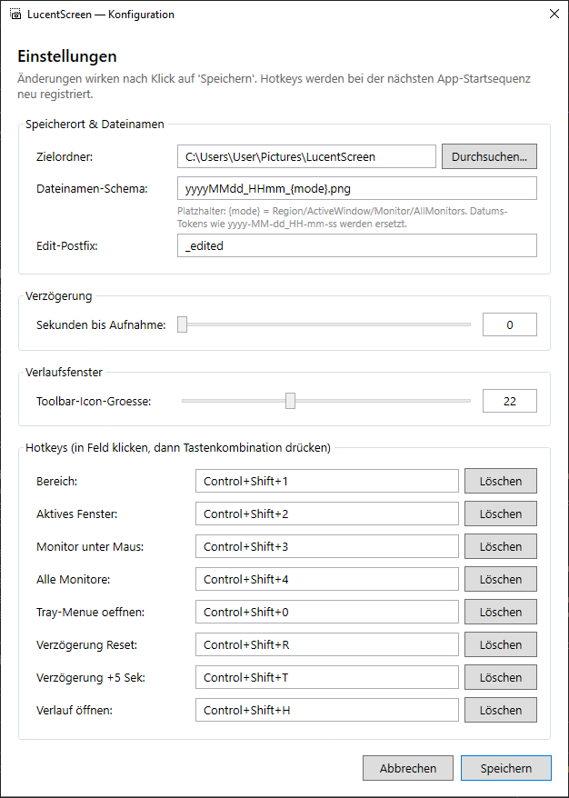
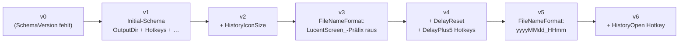

# Konfiguration

## Datei

`%APPDATA%\LucentScreen\config.json` — wird beim ersten Start angelegt mit Defaults. Schema-Versioniert, automatische Migration beim Lesen.

{ width=600 }

Alle Felder sind über den Konfig-Dialog (Tray → **Konfiguration…**) änderbar. Direkt-Editieren der JSON ist erlaubt, aber bei Validation-Fehler greift die Defaults-Strategie (Warning + Defaults).

## Schlüssel

| Key | Default | Bedeutung |
|---|---|---|
| `SchemaVersion` | aktuell **6** | Auto-migriert beim Lesen |
| `OutputDir` | `%USERPROFILE%\Pictures\LucentScreen` | Zielordner für PNGs |
| `DelaySeconds` | `0` | Countdown vor Capture (0–30) |
| `FileNameFormat` | `yyyyMMdd_HHmm_{mode}.png` | Token-Schema (siehe unten) |
| `EditPostfix` | `_edited` | Postfix für Editor-Save (`<name><postfix>.png`) |
| `HistoryIconSize` | `20` | Toolbar-Icon-Größe im Verlauf (16–32 pt) |
| `Hotkeys` | siehe unten | 8 Slots als Modifier+Key |

### Hotkeys (Default-Belegung)

```json
{
  "Region":       { "Modifiers": ["Control","Shift"], "Key": "D1" },
  "ActiveWindow": { "Modifiers": ["Control","Shift"], "Key": "D2" },
  "Monitor":      { "Modifiers": ["Control","Shift"], "Key": "D3" },
  "AllMonitors":  { "Modifiers": ["Control","Shift"], "Key": "D4" },
  "TrayMenu":     { "Modifiers": ["Control","Shift"], "Key": "D0" },
  "DelayReset":   { "Modifiers": ["Control","Shift"], "Key": "R"  },
  "DelayPlus5":   { "Modifiers": ["Control","Shift"], "Key": "T"  },
  "HistoryOpen":  { "Modifiers": ["Control","Shift"], "Key": "H"  }
}
```

`D0`–`D9` = Ziffern-Tasten der oberen Reihe. WPF-Key-Naming siehe `[System.Windows.Input.Key]`.

## Dateinamen-Schema {#dateinamen-schema}

Token im `FileNameFormat`:

| Token | Wert |
|---|---|
| `yyyy` / `yy` | Jahr 4- / 2-stellig |
| `MM` | Monat |
| `dd` | Tag |
| `HH` | Stunde 24h |
| `mm` | Minute |
| `ss` | Sekunde |
| `{mode}` | `Region` / `ActiveWindow` / `Monitor` / `AllMonitors` |
| `{postfix}` | optionaler Suffix (für Editor-Save) |

Bei Kollision (zwei Aufnahmen mit identischem Pfad) hängt die App `-2`, `-3`, … vor der Endung an. Bei Editor-Save mit kollidierendem `<name>_edited.png` analog.

## Schema-Migration



Wichtig: bei den FileNameFormat-Migrationen (3, 5) wird **nur** das exakte alte Default ersetzt — vom User selbst angepasste Templates bleiben unangetastet. Hotkey-Migrationen (4, 6) ergänzen nur fehlende Slots.

## Validation

Beim Speichern prüft `Test-ConfigValid`:

- `OutputDir` darf nicht leer sein
- `DelaySeconds` ist int 0–30
- `FileNameFormat` enthält `{mode}`
- `HistoryIconSize` ist int 16–32
- Hotkeys haben keine Konflikte (zwei Slots mit identischer Modifier+Key-Kombination)

Bei Fehlern zeigt der Dialog eine MessageBox mit Liste + die Inline-Box am unteren Rand bleibt rot markiert. Speichern ist blockiert bis die Eingaben valide sind.
